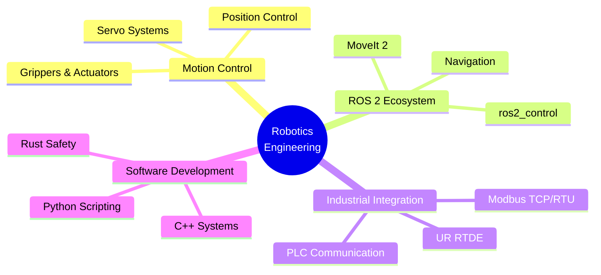

<div align="center">

<!-- Header Banner -->


<!-- Social Badges -->
<p align="center">
  <a href="mailto:hongcheol@kakao.com">
    
  </a>
  <a href="https://github.com/CottontailRabbit">
    
  </a>
  
</p>

</div>

---

### 🎯 About Me

```typescript
const hongcheol = {
    role: "Robotics Engineer",
    code: ["C++", "Python", "Rust", "MATLAB"],
    technologies: {
        robotics: ["ROS 2", "MoveIt 2", "ros2_control", "Gazebo", "Isaac Sim"],
        hardware: ["Modbus TCP/RTU", "UR RTDE", "Serial Communication"],
        tools: ["Docker", "CMake", "Git", "GitLab CI/CD"],
        ui: ["Qt", "Electron"]
    },
    expertise: ["Motion Control", "Gripper Systems", "Embedded Systems", "Industrial Automation"],
    currentFocus: "Building production-ready robotic systems from low-level drivers to high-level planning"
};
```

<div align="center">

### 🛠️ Tech Stack

<!-- Languages -->
<p>
  
</p>

<!-- Robotics & Frameworks -->
<p>
  
  
  
  
  
</p>

<!-- Tools & Technologies -->
<p>
  
</p>

</div>

---

### 🏆 Featured Projects

<table>
<tr>
  <td width="50%" valign="top">
    
#### 🤖 [DELTO_M_ROS2](https://github.com/Tesollo-Delto/DELTO_M_ROS2)

Production-ready ROS 2 package for DELTO gripper systems with full `ros2_control` integration and Modbus/TCP communication.

**Key Features:**
- Topic-based control interface
- Hardware interface for ros2_control
- Real-time Modbus/TCP protocol
- Industrial-grade reliability


  </td>
  <td width="50%" valign="top">
    
#### 🦾 [DELTO_B_ROS2](https://github.com/Tesollo-Delto/DELTO_B_ROS2)

ROS 2 driver for DELTO B-series grippers with comprehensive control features and reliability improvements.

**Key Features:**
- B-series gripper support
- Advanced control modes
- Error handling & recovery
- Production tested


  </td>
</tr>
<tr>
  <td width="50%" valign="top">
    
#### 📐 [modern_robotics_rs](https://github.com/CottontailRabbit/modern_robotics_rs)

Rust implementation of Modern Robotics algorithms, developed collaboratively with a robotics study group.

**Key Features:**
- Complete robotics mathematics library
- Type-safe Rust implementation
- Comprehensive test coverage
- Performance optimized


  </td>
  <td width="50%" valign="top">
    
#### 🔌 [LX16A_RUST](https://github.com/CottontailRabbit/LX16A_RUST)

High-performance Rust interface for LX-16A serial bus servos with reliable communication protocols.

**Key Features:**
- Serial bus communication
- Servo control & feedback
- Rust safety guarantees
- Embedded systems ready


  </td>
</tr>
</table>

---

### 📊 GitHub Analytics

<p align="center">
  
  
</p>

<p align="center">
  
  
</p>

---

### 💼 Areas of Expertise

<div align="center">



</div>

---

### 🎓 Core Competencies

<table>
  <tr>
    <td align="center" width="20%">
      
      <br><b>Motion Control</b>
      <br><sub>Grippers • Servos • Actuators</sub>
    </td>
    <td align="center" width="20%">
      
      <br><b>ROS 2 Development</b>
      <br><sub>ros2_control • MoveIt 2</sub>
    </td>
    <td align="center" width="20%">
      
      <br><b>System Programming</b>
      <br><sub>C++ • Rust • Python</sub>
    </td>
    <td align="center" width="20%">
      
      <br><b>Embedded Systems</b>
      <br><sub>Serial • Modbus • RTDE</sub>
    </td>
    <td align="center" width="20%">
      
      <br><b>Automation</b>
      <br><sub>Industrial • DevOps • CI/CD</sub>
    </td>
  </tr>
</table>

---

<div align="center">

### 🤝 Let's Connect & Collaborate

*I'm always interested in discussing robotics, ROS 2, motion control, and open-source projects*

<p>
  <a href="mailto:hongcheol@kakao.com">
    
  </a>
  <a href="https://github.com/CottontailRabbit">
    
  </a>
</p>


<sub>💙 Passionate about building reliable robotic systems | Open source contributor | Robotics community advocate</sub>

</div>
